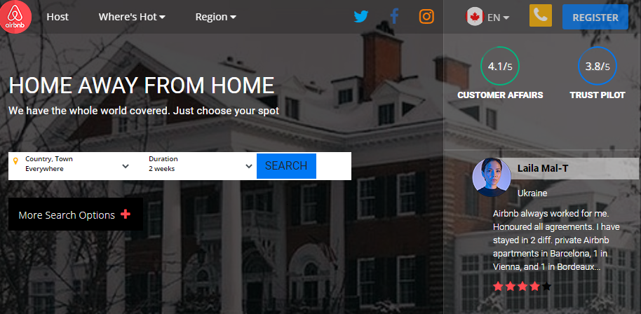

Project URL: https://kode-sektor.github.io/application-interface-redesign/source-codes/index.htm

# application-interface-redesign

This is a project that aims to re-brand the AirBnb website changing its theme, colours, calls-to-action, structure and entire layout with respect to UI/UX principles.
